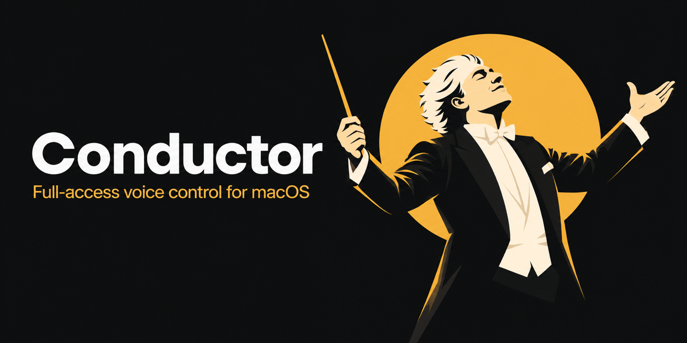

# Conductor

Conductor is a full-access macOS voice-control fork based on Jev Voice by TypeSafe.

This source includes Claude Code and Codex CLI brain options, plus optional local Whisper transcription.



[Quick start](#quick-start) · [How it works](#how-it-works) · [Full access](#full-access) · [Cost](#what-costs-money)

## Demo

<!-- demo:start -->
The voice demo is still pending. In a live check of this public build, Codex opened Calculator and completed `(6 + 7) × 5`, with `65` visible on screen. Claude's live check is waiting for the account's weekly limit to reset. The 30–40 second recording plan is in [demo/recording-plan.md](demo/recording-plan.md).
<!-- demo:end -->

## What is different

Siri handles built-in Mac requests, and Apple Dictation puts speech into text fields ([Siri guide](https://support.apple.com/guide/mac-pro/siri-apdf7bb2fad4/mac), [Dictation guide](https://support.apple.com/en-au/guide/mac-help/mh40584/26/mac/26)). This fork routes spoken requests through a CLI brain, then uses TypeSafe’s Jev action picker to choose a visible control when the task needs one. The CLI also has its own tools for files, shell commands, and web work.

I have not run a controlled comparison with Siri, dictation apps, or other computer-use agents. These numbers came from my earlier private build, on my Mac:

- One spoken command closed 17 apps in 12.6 seconds.
- Opus 5.5 answered in about 2.5 seconds.
- Local Whisper had 11.5% word error across 38 recordings, compared with 16.4% for Apple Speech.

These are results from one setup, not a general benchmark or a measurement of this clean copy.

## Quick start

Conductor is built for Apple silicon and macOS 14 or later. Build it from source with Apple’s Xcode Command Line Tools. Set up at least one CLI brain first.

### 1. Install and sign in to a brain

Choose Claude Code, Codex CLI, or both.

**Claude Code**

```sh
curl -fsSL https://claude.ai/install.sh | bash
```

When the installer finishes, open a new terminal and run `claude`. Follow the browser sign-in with a Claude Pro, Max, Team, or Enterprise account if you want to use your subscription. A Console login is separately billed at API rates, and the free Claude plan does not include Claude Code. Check Anthropic’s [setup and account requirements](https://code.claude.com/docs/en/getting-started#authenticate).

**Codex CLI**

```sh
curl -fsSL https://chatgpt.com/codex/install.sh | sh
codex
```

Choose **Sign in with ChatGPT** when it starts. OpenAI’s [Codex CLI guide](https://developers.openai.com/codex/cli) has the current installation and sign-in details.

### 2. Get a TypeSafe API key

Open the [TypeSafe quick start](https://docs.typesafe.ai/introduction/quickstart), sign in to its dashboard, and create an API key. You will enter it in Conductor after opening the app. Conductor saves it in macOS Keychain and does not read keys from shell variables or .env files.

If you already use OpenRouter, you can use an [OpenRouter API key](https://openrouter.ai/settings/keys) instead. Conductor detects the provider from the key and calls Jev through OpenRouter’s [Decisions API](https://openrouter.ai/blog/tutorials/how-to-use-jev/). That route uses your OpenRouter credits and does not need a separate TypeSafe account.

### 3. Build and open Conductor

Clone this repository from its GitHub **Code** menu. If Xcode Command Line Tools are missing, run `xcode-select --install` and wait for the installer to finish. Then, from the repository folder, run:

```sh
xcode-select -p
bash build.sh
open 'dist/Conductor.app'
```

The build uses Apple frameworks and Swift. It does not need a package manager or third-party Swift packages. It creates an unsigned app.

In Settings → **Connections**, choose the CLI you signed in to and enter your TypeSafe or OpenRouter API key under **Jev action selector**. Click **Check connection** to send a small, billable Jev request without taking any computer action. If Conductor cannot find your CLI, set its executable path in **Advanced → CLI and local speech paths**. Apple Speech works by default. Whisper is optional.

### 4. Set up local Whisper (optional)

Install CMake from [cmake.org](https://cmake.org/download/), then build [whisper.cpp](https://github.com/ggml-org/whisper.cpp) and download the model used by this app:

```sh
git clone https://github.com/ggml-org/whisper.cpp.git
cd whisper.cpp
sh ./models/download-ggml-model.sh large-v3-turbo-q5_0
cmake -B build
cmake --build build -j --config Release
printf '%s\n' "$PWD/build/bin/whisper-server" "$PWD/models/ggml-large-v3-turbo-q5_0.bin"
```

The last command prints two absolute paths. In Conductor Settings → **Advanced → CLI and local speech paths**, paste the first into the server field and the second into the model field. Turn on **Use local Whisper for final transcription**. The model is about 547 MiB; Whisper runs on your Mac and does not need a Whisper API key. See the [whisper.cpp build guide](https://github.com/ggml-org/whisper.cpp#quick-start) and [model list](https://github.com/ggml-org/whisper.cpp/blob/master/models/README.md).

### 5. Grant macOS permissions

Use the buttons in **Settings → Access → macOS permissions** for Microphone, Speech Recognition, Accessibility, and Screen Recording. macOS may ask for Automation access the first time Conductor controls another app. These system permissions still apply when the CLI is running with its approval checks bypassed.

## How it works


Apple Speech handles live transcription. Conductor asks macOS to keep recognition on the device when the selected language supports it; otherwise Apple Speech may use its network service. Optional Whisper makes a local final pass. The selected CLI receives the request, app context, screen text, open windows, and screenshots when needed. It can also use its own tools for files, commands, and web work.

The brain can open and close apps, arrange windows, open desktop sessions, and press an exact named control through the Swift controller. When it asks Jev to choose a visible control, Conductor reads the app’s Accessibility tree and sends the request, screen text, available actions, and action history through TypeSafe or OpenRouter. Jev chooses one action. The controller performs it and checks the new state before continuing. The selected Jev provider receives text, not the audio or screenshots.

The [architecture notes](docs/architecture.md) describe the data flow in more detail.

Optional local instructions and agent integrations are configured on each user's Mac. They are disabled until configured and do not depend on the original author's files. See [local integrations](docs/local-integrations.md).

## Full access

The selected CLI runs with its built-in approval and sandbox checks bypassed. There is no separate approval prompt for each action. It can read and change files, run shell commands, use AppleScript and JXA, browse the web, and control apps with Accessibility, keyboard, and pointer actions. It can attempt any task available to the signed-in macOS account.

Stop a running task with the **Stop** button or say **“cancel task.”** macOS still controls access to the microphone, speech recognition, Accessibility, screen recording, and automation. The app cannot grant or bypass those system permissions.

The CLI may read local files or app data while carrying out a request. It may also change files, send messages, or make other changes through apps if a task asks it to. Secure Accessibility fields are left out of Jev’s captured screen state, but the CLI can still reach data through its own tools. Diagnostic logs are off by default; when enabled, they can contain commands and screen text.

The **Jev activity** panel holds up to 300 Jev API call records in memory while the app is open. Those records can contain the request, screen text, available actions, and API response. Closing the app clears the history. The app does not save those records to disk.

## What costs money

Jev needs a TypeSafe API key or an OpenRouter API key. The current [TypeSafe model page](https://docs.typesafe.ai/models) lists Jev at **$0.042 per million input tokens**; output tokens are free. [Jev on OpenRouter](https://openrouter.ai/~typesafe/jev-latest) lists the same token price, paid from OpenRouter credits. OpenRouter also charges a [fee when you buy credits](https://openrouter.ai/docs/faq#pricing-and-fees). These API costs are separate from your Claude or ChatGPT subscription. Check the provider’s current prices before signing up or estimating usage.

Sign in to Claude Code or Codex with the Claude or ChatGPT subscription you already have, subject to that provider’s plan and usage limits. If you sign in to Claude Code through Claude Console, Anthropic [bills that usage separately at API rates](https://support.claude.com/en/articles/8977456-how-do-i-pay-for-my-claude-api-usage). Optional Whisper runs locally and uses your Mac’s storage and compute.

The tag workflow builds an unsigned ZIP. Signing and notarizing a public macOS download needs an Apple Developer Program membership, currently **$99 USD per year**, and a Developer ID certificate. I have not decided whether to enroll. See [Apple’s enrollment page](https://developer.apple.com/programs/enroll/) and [notarization overview](https://developer.apple.com/documentation/security/notarizing-macos-software-before-distribution).

## FAQ

**Does Conductor ask before each action?**

No. The selected CLI runs with its own approval and sandbox checks bypassed. macOS privacy permissions still apply.

**How do I stop a task?**

Click **Stop** or say **“cancel task.”**

**Does the Jev provider receive my voice or screenshots?**

No. The Jev API receives text state for action selection, including the request, screen text, available actions, and history. The CLI provider may receive screenshots when the brain needs one. Apple Speech may use Apple’s network service when on-device recognition is unavailable; optional Whisper runs locally.

**Do I need Whisper?**

No. Apple Speech is the default. Whisper is optional and runs locally.

**Can I use my existing Claude or ChatGPT subscription?**

Yes, if your plan includes CLI access and you sign in with that subscription. A Claude Console login uses separately billed API usage. The provider’s plan and usage limits can change.

**Can I publish or redistribute the fork?**

The upstream repository has no license file, and this copy does not add one. Get TypeSafe’s written permission and agree on license terms before publishing or redistributing the fork. See [credits and licensing](docs/credits-and-license.md).

## Credit and release

Conductor is based on [Jev Voice by TypeSafe](https://github.com/ronadin2002/jev-cua). TypeSafe’s project and its authors are credited as the base.

The GitHub Actions workflow builds an unsigned Apple silicon ZIP on a `v*` tag and attaches it to the workflow run. It does not create a GitHub Release or notarize the app.
