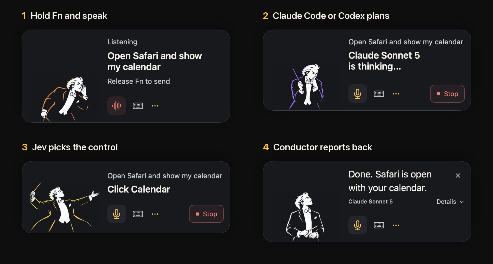
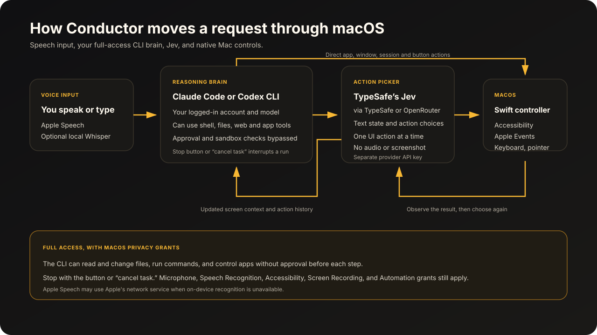

<p align="center">
  
</p>

<p align="center">
  <a href="#quick-start">Quick start</a> · <a href="#how-it-works">How it works</a> · <a href="#full-access">Full access</a> · <a href="#cost">Cost</a> · <a href="#credits">Credits</a>
</p>

Conductor lets you run your Mac by voice. You hold Fn, say what you want, and Claude Code or Codex carries it out across your apps. When a task needs a specific button or field, TypeSafe's Jev picks it.

I built it on top of [Jev Voice by TypeSafe](https://github.com/ronadin2002/jev-cua) because I wanted to run my Claude and Codex sessions, and the rest of my Mac, by voice without approving every step. 



## What it does

- Hold Fn or right Option to talk and release to send. You can keep talking while it works, and new requests wait in a queue.
- Claude Code or Codex CLI does the thinking, signed in with the Claude or ChatGPT subscription you already have.
- It opens and quits apps, arranges windows, opens your Claude and Codex sessions, and presses named controls directly. For anything else on screen, Jev reads the app's Accessibility tree and chooses the next click or keystroke.
- Local Whisper can do the final transcription pass on your Mac.
- Say "cancel task" or press Stop to end a run.

The interface is in English and Russian.

## Quick start

You need macOS 14 or later on Apple silicon, Xcode Command Line Tools and at least one CLI brain.

### 1. Sign in to a brain

**Claude Code**

```sh
curl -fsSL https://claude.ai/install.sh | bash
```

Open a new terminal, run `claude` and sign in with a Claude Pro, Max, Team or Enterprise account. A Console login is billed at API rates ([Anthropic's setup guide](https://code.claude.com/docs/en/getting-started#authenticate)).

**Codex CLI**

```sh
curl -fsSL https://chatgpt.com/codex/install.sh | sh
codex
```

Choose **Sign in with ChatGPT** ([OpenAI's Codex CLI guide](https://developers.openai.com/codex/cli)).

### 2. Get a Jev key

Create an API key in the [TypeSafe dashboard](https://docs.typesafe.ai/introduction/quickstart). An [OpenRouter key](https://openrouter.ai/settings/keys) works too: Conductor recognizes it and calls Jev through OpenRouter's [Decisions API](https://openrouter.ai/blog/tutorials/how-to-use-jev/).

### 3. Build and open

```sh
xcode-select --install   # only if the tools are missing
git clone https://github.com/Seryozh/conductor.git
cd conductor
bash build.sh
open dist/Conductor.app
```

The build uses Swift and Apple frameworks only, with no packages to install. In Settings → **Connections**, pick your CLI, paste the Jev key under **Jev action selector** and click **Check connection**. The key is stored in macOS Keychain. If Conductor can't find your CLI, set its path in **Advanced → CLI and local speech paths**.

### 4. Grant permissions

**Settings → Access** has buttons for Microphone, Speech Recognition, Accessibility and Screen Recording. macOS asks for Automation the first time Conductor controls another app.

### 5. Local Whisper (optional)

Apple Speech works out of the box. Whisper made fewer mistakes on my voice: 11.5% word error across 38 of my recordings, against 16.4% for Apple Speech. To set it up, install [CMake](https://cmake.org/download/) and build [whisper.cpp](https://github.com/ggml-org/whisper.cpp):

```sh
git clone https://github.com/ggml-org/whisper.cpp.git
cd whisper.cpp
sh ./models/download-ggml-model.sh large-v3-turbo-q5_0
cmake -B build
cmake --build build -j --config Release
printf '%s\n' "$PWD/build/bin/whisper-server" "$PWD/models/ggml-large-v3-turbo-q5_0.bin"
```

Paste the two printed paths into **Settings → Advanced → CLI and local speech paths** and turn on **Use local Whisper for final transcription**. The model is about 547 MiB and runs on your Mac.

## How it works



Apple Speech transcribes while you talk and stays on the device when your language supports it. Whisper, if you turned it on, makes the final pass locally. The request goes to the CLI together with the frontmost app, screen text, open windows and a screenshot when the brain asks for one.

The brain works through its own tools (shell, files, AppleScript) or through Conductor's controller. When it needs a visible control, Conductor reads the app's Accessibility tree and sends Jev the request, screen text, available actions and action history. Jev picks one action, the controller performs it and checks the new state before the next step. Jev gets text only, never your audio or screenshots.

[Architecture notes](docs/architecture.md) · [Local integrations](docs/local-integrations.md) · [Local control](docs/local-control.md) · [Checks](docs/testing.md)

## Full access

The CLI runs with its approval prompts and sandbox turned off, so it can read and change files, run shell commands, use AppleScript, browse the web and click through any app your macOS account can reach, without asking first. macOS permissions still decide what Conductor can touch, and Stop or "cancel task" ends a run.

Diagnostic logs are off by default. The Jev activity panel keeps up to 300 recent Jev calls in memory and clears them when you quit.

## Cost

Jev costs $0.042 per million input tokens on [TypeSafe](https://docs.typesafe.ai/models) or [OpenRouter](https://openrouter.ai/~typesafe/jev-latest), and output tokens are free. OpenRouter adds [a fee when you buy credits](https://openrouter.ai/docs/faq#pricing-and-fees). The brain runs on your Claude or ChatGPT subscription, and Whisper is free.

## Credits

Conductor is built on [Jev Voice](https://github.com/ronadin2002/jev-cua) by Ron Adin and TypeSafe, with direct TypeSafe API support from [r33drichards](https://github.com/r33drichards). Jev is TypeSafe's action model. Building and release notes are in [docs/release.md](docs/release.md).
